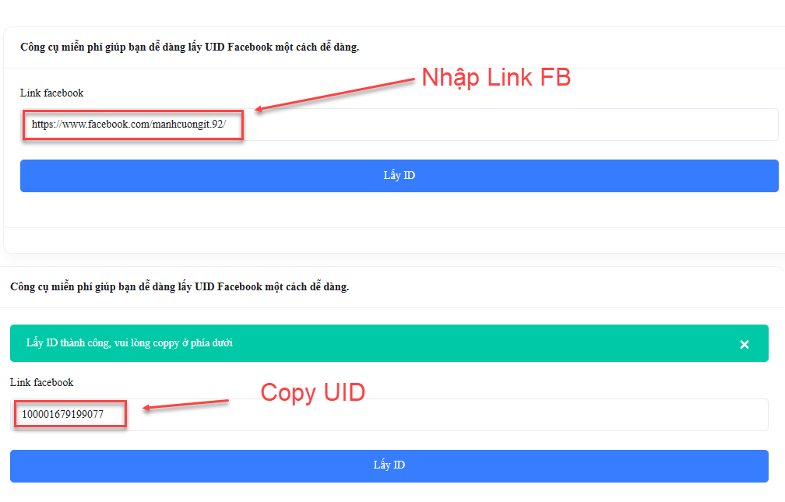

# Hướng dẫn tìm SĐT từ Account Facebook

## **Công cụ sử dụng**

Có thể linh hoạt sử dụng 1 trong 2 công cụ (nếu 1 công cụ lỗi thì chuyển sang công cụ còn lại):

1. [https://sotel.vn/](https://sotel.vn/)
2. [https://trieudola.com/fb/data/index.php](https://trieudola.com/fb/data/index.php)

### **Cách 1: Tra cứu bằng Sotel (Ưu tiên dùng trước)**

**Bước 1:** Truy cập: [https://sotel.vn/](https://sotel.vn/cong-cu-lay-so-dien-thoai-tu-facebook-mien-phi/)

**Bước 2:** Nhập link Facebook của khách hàng (profile hoặc page).

<figure><figcaption></figcaption></figure>

**Bước 3:** Thực hiện tra cứu → hệ thống sẽ trả về thông tin (nếu có), bao gồm SĐT.

<figure><figcaption></figcaption></figure>

#### **Ưu điểm:**

* Nhanh, thao tác đơn giản
* Không cần lấy UID

### **Cách 2: Tra cứu bằng Trieudola**

**Bước 1:** Lấy UID Facebook

* Truy cập: [https://id.traodoisub.com/](https://id.traodoisub.com/)
* Dán link Facebook của khách hàng
* Copy UID được trả về

<figure><figcaption></figcaption></figure>

**Bước 2: Tra cứu dữ liệu**

* Truy cập: [https://trieudola.com/fb/data/index.php](https://trieudola.com/fb/data/index.php)
* Nhập UID vừa lấy
* Thực hiện tìm kiếm để lấy thông tin SĐT (nếu có)

<figure><figcaption></figcaption></figure>

<figure><figcaption></figcaption></figure>

#### **Lưu ý:**

* Bắt buộc phải có UID mới tra được
* Không nhập link trực tiếp (khác với Sotel)

### **Cách 3: Không tra được từ công cụ**

Trong trường hợp đã thử cả 2 công cụ nhưng không có kết quả:

**Bước 1:** Copy link Facebook của khách hàng

**Bước 2:** Gửi vào group Zalo [**Ftel-Monitaz check KH**](https://zalo.me/g/xkrwua857) để nhờ hỗ trợ check thông tin KH

<figure><figcaption></figcaption></figure>

**Lưu ý chung**

* Không phải tài khoản nào cũng có thể tra được SĐT
* Kết quả phụ thuộc vào dữ liệu hệ thống lưu trữ
* Nên thử cả 2 công cụ nếu không ra kết quả
* Sử dụng thông tin đúng mục đích công việc, tuân thủ quy định bảo mật

**Tóm tắt**&#x20;

* Dùng Sotel trước → nhanh, không cần UID
* Nếu lỗi → chuyển Trieudola → lấy UID trước rồi tra
* Linh hoạt đổi tool khi cần
